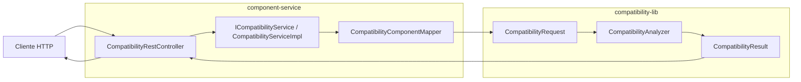
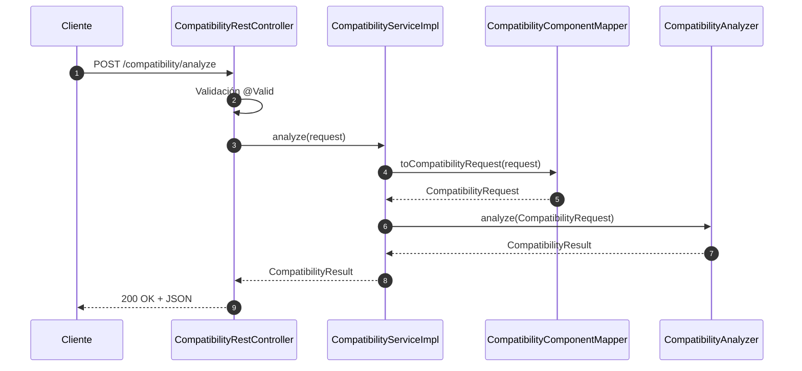

# Integración de component-service con compatibility-lib

## Resumen

El microservicio component-service incorpora una capa de análisis de compatibilidad apoyada en compatibility-lib. La responsabilidad del microservicio es recibir la solicitud HTTP, validarla, traducirla al modelo de la librería y exponer el resultado en formato JSON. La lógica de compatibilidad permanece completamente dentro de compatibility-lib.

## Arquitectura



## Flujo completo

1. El cliente hace un POST al endpoint /api/v1/component-service/compatibility/analyze.
2. Spring valida el payload contra CompatibilityAnalysisRequest.
3. CompatibilityRestController delega en ICompatibilityService.
4. CompatibilityServiceImpl usa CompatibilityComponentMapper para construir el CompatibilityRequest de compatibility-lib.
5. CompatibilityServiceImpl invoca CompatibilityAnalyzer.analyze(...).
6. compatibility-lib devuelve CompatibilityResult.
7. El controlador devuelve ese resultado directamente como respuesta HTTP 200.

## Archivos creados

- src/main/java/com/techplanner/componentservice/config/CompatibilityAnalyzerConfig.java
- src/main/java/com/techplanner/componentservice/delivery/dto/compatibility/CompatibilityAnalysisRequest.java
- src/main/java/com/techplanner/componentservice/delivery/mapper/CompatibilityComponentMapper.java
- src/main/java/com/techplanner/componentservice/domain/services/ICompatibilityService.java
- src/main/java/com/techplanner/componentservice/domain/services/CompatibilityServiceImpl.java
- src/main/java/com/techplanner/componentservice/delivery/rest/CompatibilityRestController.java
- src/test/java/com/techplanner/componentservice/domain/services/CompatibilityServiceImplTest.java
- src/test/java/com/techplanner/componentservice/delivery/rest/CompatibilityRestControllerTest.java

## Archivos modificados

- src/main/java/com/techplanner/componentservice/domain/services/ComponentServiceImpl.java

## Dependencias utilizadas

La dependencia ya estaba declarada en pom.xml:

- com.techplanner:compatibility-lib:1.0.0-SNAPSHOT

El resto del stack se mantiene igual:

- Spring Boot 3.5.14
- Java 21
- spring-boot-starter-web
- spring-boot-starter-validation
- spring-boot-starter-data-jpa
- spring-boot-starter-test

## Construcción de CompatibilityRequest

El mapper centraliza la traducción de los datos del microservicio hacia compatibility-lib.

### Desde el request del endpoint

CompatibilityAnalysisRequest contiene seis bloques:

- cpu
- gpu
- ram
- motherboard
- psu
- storage

Cada bloque se transforma usando los builders de compatibility-lib.

### Mapeo de enumeraciones

El mapper normaliza textos como AM5, DDR5, PCIE_5 y NVME para convertirlos a:

- CpuSocket
- RamType
- PcieVersion
- FormFactor
- StorageType

### Resultado

El objeto final es CompatibilityRequest, construido con:

- cpu(...)
- gpu(...)
- ram(...)
- motherboard(...)
- psu(...)
- storage(...)

## Transformación de CompatibilityResult

No se crea un DTO intermedio ni se altera la semántica del resultado.

- compatibility-lib devuelve CompatibilityResult.
- component-service lo retorna directamente.
- Spring Boot lo serializa a JSON.

Los campos expuestos son:

- compatible
- status
- compatibilityScore
- warnings
- errors
- recommendations
- estimatedPowerConsumption
- recommendedPsu

## Diagrama de secuencia



## Ejemplo de request JSON

```json
{
  "cpu": {
    "brand": "AMD",
    "model": "Ryzen 7 7800X3D",
    "socket": "AM5",
    "cores": 8,
    "threads": 16,
    "tdp": 120,
    "integratedGraphics": false,
    "price": 2399000
  },
  "gpu": {
    "brand": "NVIDIA",
    "model": "RTX 4070",
    "chipset": "AD104",
    "vram": 12,
    "recommendedWattage": 650,
    "pcieVersion": "PCIE_4",
    "lengthMm": 267,
    "price": 3299000
  },
  "ram": {
    "brand": "Corsair",
    "model": "Vengeance",
    "type": "DDR5",
    "capacityGb": 32,
    "speedMHz": 6000,
    "voltage": 1.35,
    "sticks": 2,
    "price": 899000
  },
  "motherboard": {
    "brand": "ASUS",
    "model": "TUF Gaming B650",
    "socket": "AM5",
    "ramType": "DDR5",
    "maxRam": 128,
    "ramSlots": 4,
    "supportedRamSpeed": 6000,
    "pcieVersion": "PCIE_5",
    "formFactor": "ATX",
    "sataPorts": 4,
    "m2Slots": 2,
    "price": 1299000
  },
  "psu": {
    "brand": "Corsair",
    "model": "RM850e",
    "wattage": 850,
    "efficiency": "80+ Gold",
    "modular": true,
    "formFactor": "ATX",
    "price": 749000
  },
  "storage": {
    "brand": "Kingston",
    "model": "NV2",
    "type": "NVME",
    "interfaceType": "PCIe 4.0",
    "capacityGb": 1000,
    "readSpeed": 3500,
    "writeSpeed": 2800,
    "price": 399000
  }
}
```

## Ejemplo de response JSON

```json
{
  "compatible": true,
  "status": "COMPATIBLE",
  "compatibilityScore": 92,
  "warnings": [],
  "errors": [],
  "recommendations": [
    "..."
  ],
  "estimatedPowerConsumption": 430,
  "recommendedPsu": 550
}
```

## Validación realizada

Se ejecutaron con éxito los tests focalizados:

- src/test/java/com/techplanner/componentservice/domain/services/CompatibilityServiceImplTest.java
- src/test/java/com/techplanner/componentservice/delivery/rest/CompatibilityRestControllerTest.java

La validación confirmó que:

- el endpoint responde correctamente,
- el servicio delega en CompatibilityAnalyzer,
- el request se mapea correctamente,
- el resultado se serializa sin adaptadores adicionales.