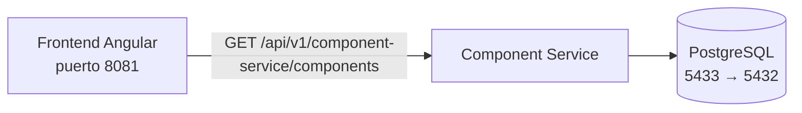
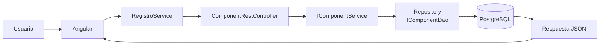
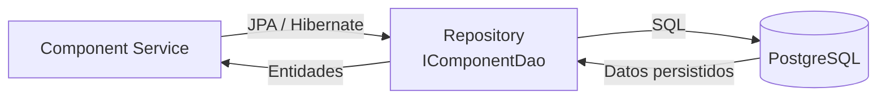
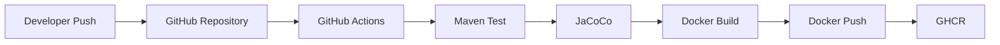
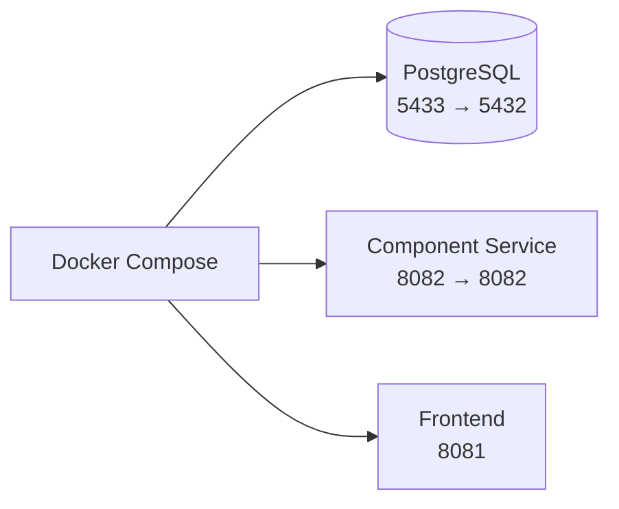
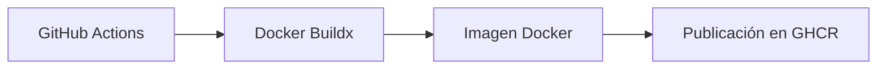

# component-service

Microservicio Spring Boot orientado a la gestión de componentes de hardware dentro de la plataforma TechPlanner. El proyecto expone una API REST versionada, persiste datos en PostgreSQL y se integra con un frontend Angular mediante consumo HTTP.

## Arquitectura y Flujo CI/CD

### Arquitectura General

Este diagrama resume la arquitectura de integración principal. El frontend Angular consume el endpoint `GET /api/v1/component-service/components`, el microservicio procesa la solicitud y PostgreSQL actúa como almacén de persistencia.

### Flujo de Ejecución

Este flujo representa la ejecución completa de una consulta desde la interfaz hasta la base de datos y el retorno de la respuesta JSON al frontend.

### Flujo de Integración con PostgreSQL

La persistencia se realiza mediante Spring Data JPA sobre PostgreSQL. El repositorio abstrae el acceso a datos y mantiene separada la lógica de negocio del almacenamiento físico.

### Flujo GitHub Actions

El pipeline ejecuta pruebas con Maven, genera el reporte de cobertura con JaCoCo y, en pushes a `main`, construye y publica la imagen en GitHub Container Registry.

### Flujo Docker Compose

Este escenario describe la orquestación local o de integración. En el repositorio actual, el servicio Spring Boot escucha en `8082` y PostgreSQL se expone localmente en `5433` hacia el contenedor `5432`.

### Flujo de Construcción y Publicación de Imagen Docker

La imagen se construye con Docker Buildx y se publica en GHCR como parte del flujo de integración continua definido en el repositorio.

## Referencias de integración

- API principal: `GET /api/v1/component-service/components`
- Servidor web del microservicio: `8082`
- PostgreSQL en Docker Compose: `5433:5432`
- Frontend Angular documentado para integración: `8081`

## Notas técnicas

- El controlador REST está versionado bajo `/api/v1/component-service`.
- La capa de servicio se expone mediante `IComponentService`.
- La persistencia utiliza Spring Data JPA sobre `IComponentDao`.
- El flujo de CI/CD genera evidencia de pruebas y cobertura antes de publicar la imagen.